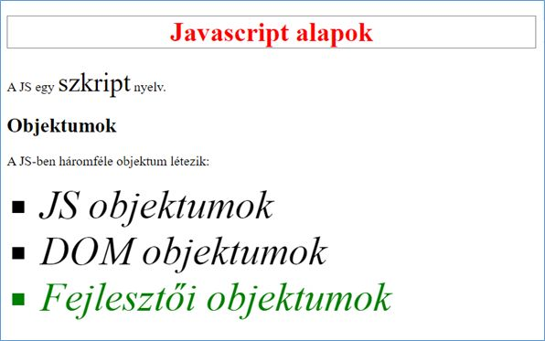

# Feladat 1

1. Hozz létre egy 1-es szintű címsort
   - Az 1-es szintű címsor tartalma a mintának megfelelő legyen
   - Az 1-es címsor betűszíne piros legyen.
   - Az 1-es címsornak legyen 1px folytonos fekete kerete.
2. Hozz létre egy leiras osztályjelölővel ellátott bekezdést
   - A bekezdés tartalma a minta szerint legyen
   - A bekezdés belsejébe hozz létre egy span taget és helyezd bele a szkript szót
   - a span-ben levő szöveg betűmérete legyen 2-szerese az alapértelmezett böngésző betűméretének
3. Hozz létre egy 2-es címsort
   - A 2-es címsor tartalma a minta szerinti legyen
   - A 2-es címsort lásd el obj azonosítóval.
4. Hozz létre egy osztalyozas osztályjelölővel ellátott bekezdést
   - A bekezdés tartalma a minta szerint legyen
5. Hozz létre egy számozatlan felsorolást
   - A felsorolás 3 listaelemet tartalmazzon
   - A listaelemek felsorolás jele négyzetes legyen
   - A listaelemek betűmérete 3x legyen az alapértelmezett betűméretnek.

